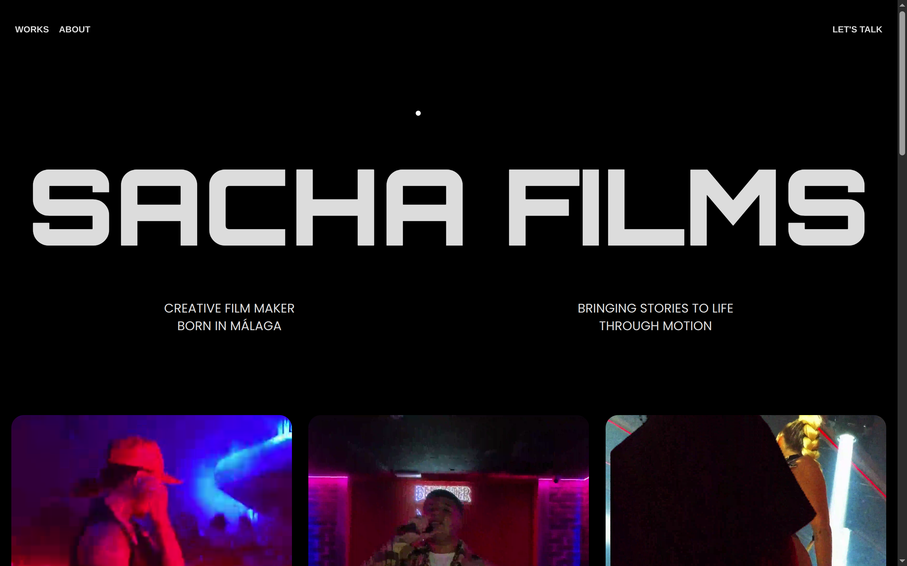
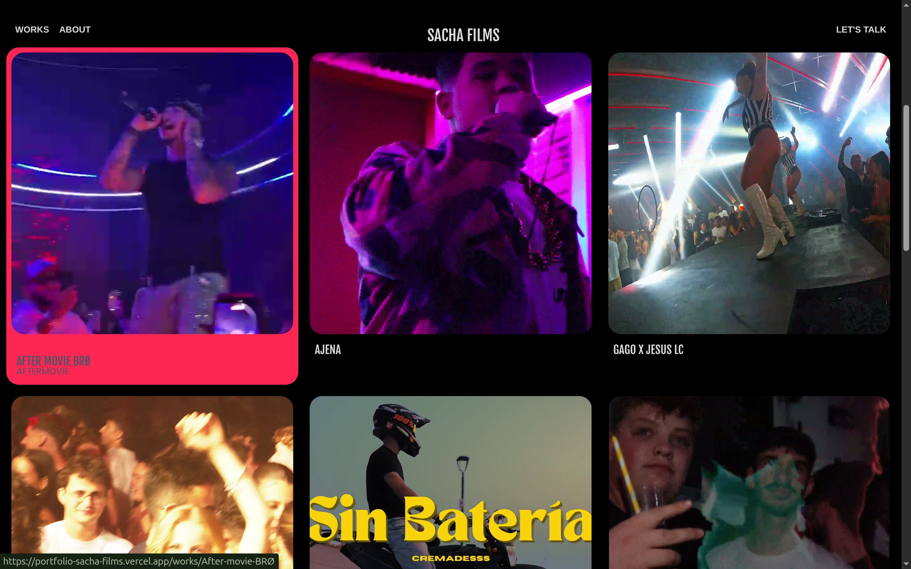
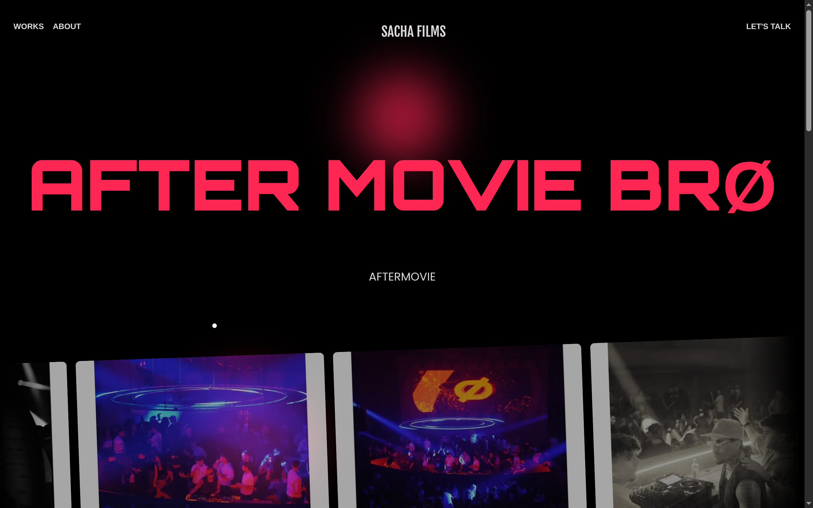
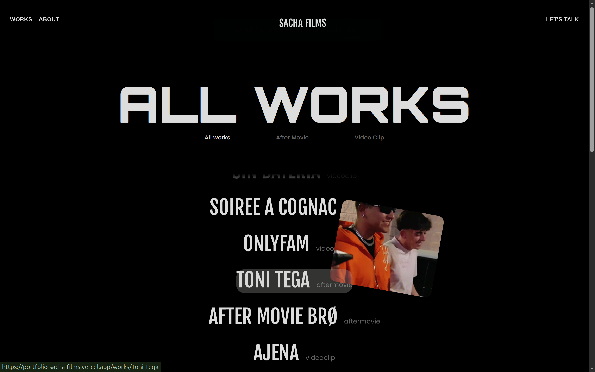

# 🎬 Sacha Films — Creative Filmmaker Portfolio

_Note: This repository highlights the frontend development, advanced UI animations, and media integration built for Sacha Films, a creative filmmaker based in Málaga._

🔗 **[Visit the live website here](https://portfolio-sacha-films.vercel.app/)**

## 📖 Overview

**Sacha Films** is a premium, highly interactive web portfolio designed to bring stories to life through motion. Built with a dark, cinematic aesthetic, the website focuses on delivering a seamless, immersive experience. The architecture prioritizes fluid animations, heavy typography, and dynamic video integration to showcase the filmmaker's projects—ranging from music videos to after-movies—without compromising on performance.

## ⚡ Tech Stack

- **Frontend Framework:** [Next.js](https://nextjs.org/) (React)
- **Deployment:** [Vercel](https://vercel.com/)
- **Styling & Animations:** Tailwind CSS / Custom CSS (with advanced cursor-tracking and scroll animations)
- **Media Hosting:** Optimized video & image delivery for fast loading.

## ✨ Key Features & Technical Highlights

- **Cinematic UI/UX:** A deep, dark-themed interface utilizing large, bold typography that mimics a movie poster aesthetic.
- **Dynamic Media Integration:** Features auto-playing video previews on hover and custom-styled vertical video players for mobile-first content (e.g., TikTok/Reels style clips).
- **Advanced Animations:** Implementation of complex interactive elements, such as project thumbnails that smoothly track and follow the user's cursor across the screen in the "All Works" section.
- **Category Filtering:** A dynamic, instant-filtering system allowing users to sort the portfolio by categories like _After Movie_ and _Video Clip_ without page reloads.
- **Interactive Contact Module:** A sleek footer section featuring "Click-to-Copy" functionality for the email address and phone number, providing instant user feedback.

## 📸 Interface Previews

### Hero Section & Typography

### Dynamic Project Grid

### Project Detail & Vertical Video Integration

### Interactive Cursor-Tracking Gallery

